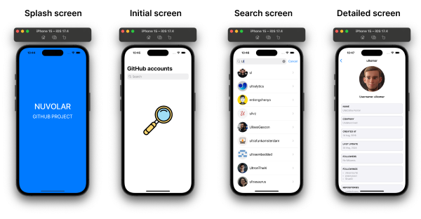
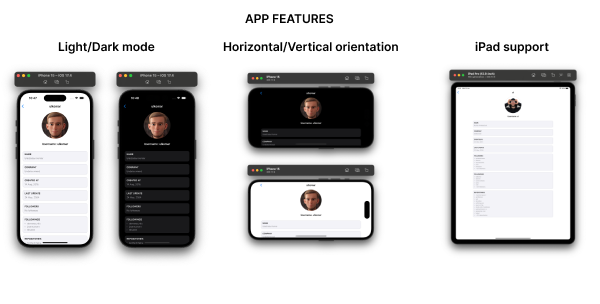

# Mobile App Project: NUVOLAR

## Introduction
Welcome to the **NUVOLAR App Project**! This app showcases the capabilities of iOS development technologies, offering a seamless user experience and robust functionality.

## User Features
- **Splash Screen**: Engaging introductory screen for a smooth app launch experience.
- **Search User Screen**: Effortlessly find users with a sleek and intuitive search interface.
- **Detailed User Screen**: Dive deep into user profiles with detailed information and interactive elements.

## App Features
- **Light/Dark Mode**: Seamlessly switch between light and dark modes for optimal viewing comfort.
- **Error Handling**: Intuitive error handling with clear, red text indicators for easy troubleshooting.

## Available Platforms
- **iOS**
- **iPadOS**

## Used iOS Development Technologies
- **Swift**: The modern programming language for iOS development.
- **UIKit**: Apple's framework for building user interfaces.
- **Combine**: Apple's reactive programming framework for handling asynchronous events.
- **XCTest**: Apple's testing framework for unit testing.
- **Foundation**: The core framework providing essential services for iOS apps.

## Pattern
- **MVVM**: Model-View-ViewModel architectural pattern for separation of concerns and maintainability.
- **Factory**: Design pattern for creating objects without specifying the exact class to be created.
- **Singleton**: Design pattern ensuring a class has only one instance and providing a global point of access to it.

## iOS App Development Features
- **Coordinator Pattern**: Elegant navigation management using the coordinator pattern for improved code organization.
- **Image Caching**: Efficient image caching utilizing `NSCache` for faster loading and reduced network usage.
- **Pagination**: Seamless pagination for handling large datasets with minimal performance impact.
- **BaseViewController and Common ViewModel**: Streamlined screen development with reusable base classes and view models.
- **Domain Layer**: Clean separation of concerns with a dedicated domain layer for handling network responses.
- **State Machine**: Efficient interaction between ViewControllers and ViewModels with a well-defined state machine.
- **Independent Network Layer with Models**: Modularized network layer with clear, independent model definitions for enhanced readability and maintainability.
- **Reusable UI Elements**: Modularized UI elements for improved code reusability and scalability.
- **UIKit Configuration**: Leveraging UIKit's latest features for configuring cells based on their states.
- **Factory for Screen Assembly in Coordinators**: Centralized screen assembly logic using factories for enhanced code organization and readability.
